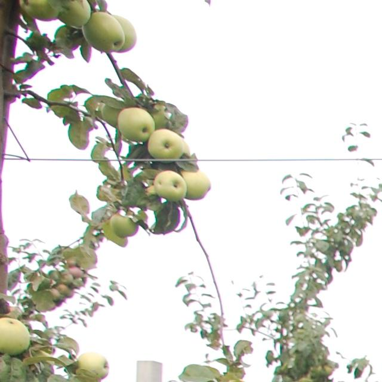
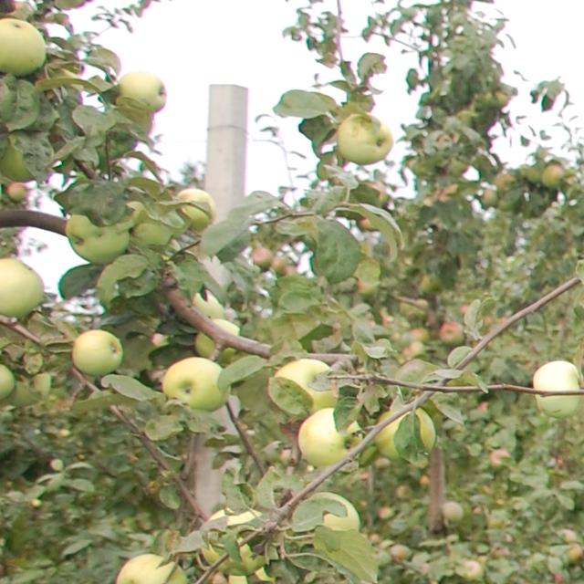
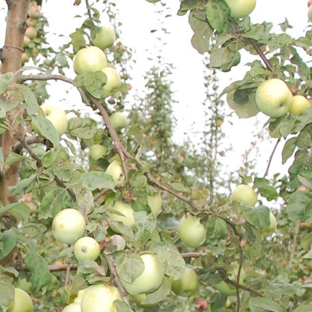

# AppleBBCH76

[](https://creativecommons.org/licenses/by/4.0/)
[](https://github.com/ai-agriculture-circuits-and-systems/AppleBBCH76)
[](https://github.com/ai-agriculture-circuits-and-systems/AppleBBCH76)
[](https://github.com/ai-agriculture-circuits-and-systems/AppleBBCH76)
[](https://github.com/ai-agriculture-circuits-and-systems/AppleBBCH76)
[](https://github.com/ai-agriculture-circuits-and-systems/AppleBBCH76/issues)
[](https://github.com/ai-agriculture-circuits-and-systems/AppleBBCH76/pulls)
[](https://github.com/ai-agriculture-circuits-and-systems/AppleBBCH76/graphs/contributors)
[](https://github.com/ai-agriculture-circuits-and-systems/AppleBBCH76/commits)
[](https://doi.org/10.5281/zenodo.xxxxx)

The photo fixation of apple fruitlets was done in the LatHort orchard in Dobele, at the development of fruit (BBCH stage 76-78). BBCH-scale describes the phenological development of grapes: 7 - development of fruit; 76 - fruit about 60% final size; 78 - fruit about 80% final size. Two photo images were taken for each tree – perpendicularly, in a tree-facing view and in an oblique view. The images were annotated using the tool makesense.ai. Then the annotated images 3008x2000 were automatically cropped out on 640x640 images with overlap 30% and validated manually. The images were saved in YOLO format.

- **Project page**: `https://www.kaggle.com/datasets/projectlzp201910094/applebbch76`
- **Dataset repository**: `https://github.com/ai-agriculture-circuits-and-systems/AppleBBCH76`

## TL;DR

- **Task**: Detection
- **Modality**: RGB
- **Platform**: Ground
- **Real/Synthetic**: Real
- **Images**: 3,169 images
- **Classes**: 1 class (apple)
- **Resolution**: 640×640 pixels (cropped from 3008×2000)
- **Annotations**: YOLO (.txt) and COCO JSON
- **License**: CC BY 4.0 (see License)
- **Citation**: see below

## Table of Contents

- [Download](#download)
- [Dataset Structure](#dataset-structure)
- [Sample Images](#sample-images)
- [Annotation Schema](#annotation-schema)
- [Stats and Splits](#stats-and-splits)
- [Quick Start](#quick-start)
- [Evaluation and Baselines](#evaluation-and-baselines)
- [Datasheet (Data Card)](#datasheet-data-card)
- [Known Issues and Caveats](#known-issues-and-caveats)
- [License](#license)
- [Citation](#citation)
- [Changelog](#changelog)
- [Contact](#contact)

## Download

**Original dataset**: `https://www.kaggle.com/datasets/projectlzp201910094/applebbch76`

This repo hosts structure and conversion scripts only; place the downloaded folders under this directory.

**Local license file**: See `LICENSE` in the root directory (Creative Commons Attribution 4.0 International).

**Alternative sources**: Data hosted on Kaggle.

## Dataset Structure
```
datasets/AppleBBCH76/
├── data/
│   ├── images/               # images (*.jpg)
│   └── labels/               # YOLO labels (*.txt)
├── annotations/              # COCO JSON exports
├── scripts/                  # utilities
│   ├── convert_to_coco.py
│   └── generate_splits.py
├── sets/                     # split lists (train/val/test)
└── README.md
```
- Splits: `sets/train.txt`, `sets/val.txt`, `sets/test.txt`, `sets/all.txt`

## Sample Images
<table>
  <tr>
    <th>Sample</th>
    <th>Image</th>
  </tr>
  <tr>
    <td><strong>Example 1</strong></td>
    <td>
      
      <div align="center"><code>data/images/DSC_1046_17kv10r3k_0.jpg</code></div>
    </td>
  </tr>
  <tr>
    <td><strong>Example 2</strong></td>
    <td>
      
      <div align="center"><code>data/images/DSC_1046_17kv10r3k_1.jpg</code></div>
    </td>
  </tr>
  <tr>
    <td><strong>Example 3</strong></td>
    <td>
      
      <div align="center"><code>data/images/DSC_1046_17kv10r3k_10.jpg</code></div>
    </td>
  </tr>
</table>

## Annotation Schema
- COCO-style (example):
```json
{
  "info": {"year": 2024, "version": "1.0.0", "description": "AppleBBCH76", "url": "https://www.kaggle.com/datasets/projectlzp201910094/applebbch76", "date_created": "2024-04-12"},
  "images": [{"id": 1, "file_name": "xxx.jpg", "width": 640, "height": 640}],
  "categories": [{"id": 1, "name": "apple", "supercategory": "fruit"}],
  "annotations": [{"id": 10, "image_id": 1, "category_id": 1, "bbox": [x,y,w,h], "area": 1234, "iscrowd": 0}]
}
```
- YOLO-style (per-image `.txt`): `<class_id> <x_center> <y_center> <width> <height>` (normalized 0–1)

## Stats and Splits
- Counts: images per split and instances per class (1 class: `apple`)
- Use `scripts/generate_splits.py` to create `train/val/test` lists

## Quick Start
Python (COCO):
```python
from pycocotools.coco import COCO
coco = COCO("annotations/applebbch76_instances_train.json")
img_ids = coco.getImgIds()
img = coco.loadImgs(img_ids[0])[0]
ann_ids = coco.getAnnIds(imgIds=img['id'])
anns = coco.loadAnns(ann_ids)
```

Convert YOLO labels to COCO JSON:
```bash
# Per-split (requires split files in `sets/`)
python scripts/convert_to_coco.py \
  --images data/images \
  --labels data/labels \
  --out annotations \
  --splits train val test \
  --split-dir sets

# Single combined file (all images found under data/images)
python scripts/convert_to_coco.py \
  --images data/images \
  --labels data/labels \
  --out annotations
```

Generate train/val/test split files:
```bash
python scripts/generate_splits.py --images data/images --out sets --train 0.8 --val 0.1 --test 0.1 --seed 42
```

Dependencies:
```bash
python -m pip install pillow
# Optional, for the COCO API example above
python -m pip install pycocotools
```

## Evaluation and Baselines
- Metric: mAP@[.50:.95] (COCO), IoU for bbox overlap

| Method | Backbone | Metric(s) | Link |
|---|---|---|---|
| – | – | – | – |

## Datasheet (Data Card)
- Motivation: apple detection in orchard scenes
- Composition: 3,169 images, 1 class
- Collection process: field images (see Kaggle page)
- Preprocessing: none required; labels in YOLO, COCO produced by script
- Distribution: open; see License
- Maintenance: community-maintained

## Known Issues and Caveats
- Original labels are YOLO; COCO JSON is derived via script.

## License
- CC BY 4.0. See `LICENSE` in this folder.

## Citation
```bibtex
@misc{applebbch76,
  title={AppleBBCH76},
  year={2024},
  note={Kaggle dataset},
  url={https://www.kaggle.com/datasets/projectlzp201910094/applebbch76}
}
```

## Changelog
- V1.0.0: initial standardized layout and COCO converter (2025-08-12)

## Contact
- Maintainer(s): community 
- Issues: this repo